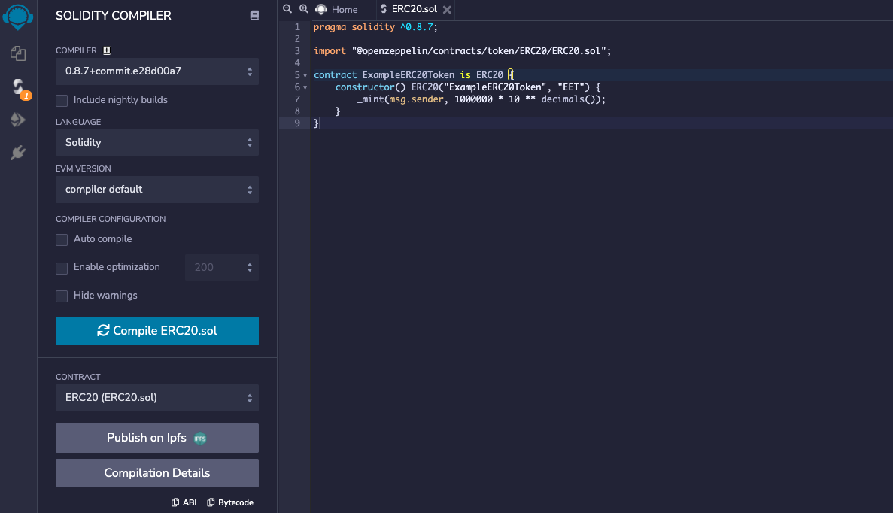
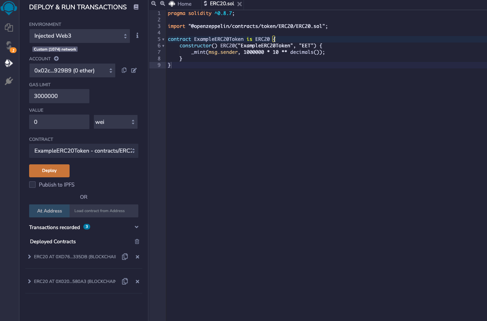
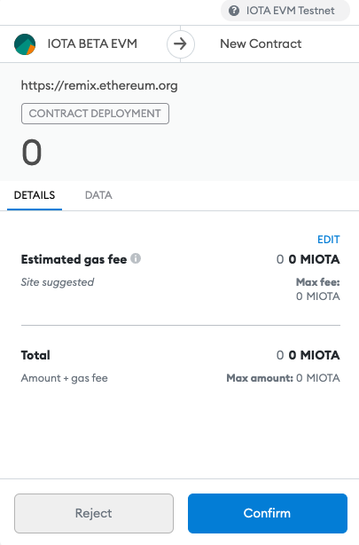
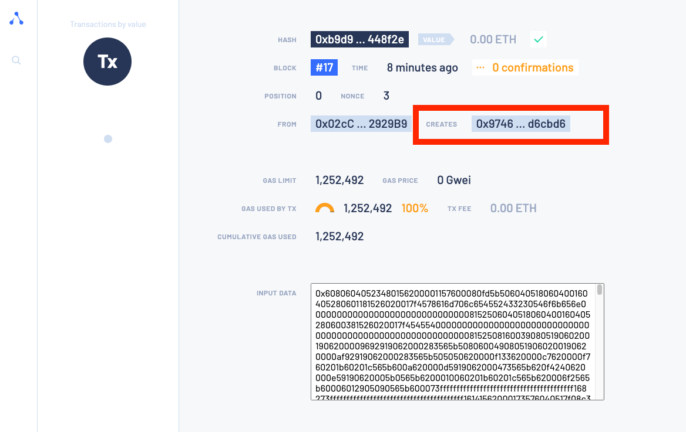
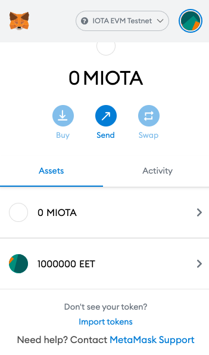

ERC20 is a standard for fungible tokens and is defined in the [EIP-20 Token Standard](https://eips.ethereum.org/EIPS/eip-20) by Ethereum.

With the ERC20 standart you can create your own tokens and transfer them in the EVM on IOTA Smart Contracts without fees.

You can use the [Remix IDE](https://remix.ethereum.org/) to deploy any regular Solidity Smart Contract.

Set the environment to `Injected Web3`, and connect Remix with your MetaMask wallet. 
Read this [how to connect your Metamask with the public Testnet.](/wasp/guide/chains_and_nodes/testnet#interact-with-evm).

## 1. Create a Smart Contract

Create a new Solidity file, for example `ÈRC20.sol` in the contracts folder of your [Remix IDE](https://remix.ethereum.org/) and add this code snippet:

```solidity
pragma solidity ^0.8.7;

import "@openzeppelin/contracts/token/ERC20/ERC20.sol";

contract ExampleERC20Token is ERC20 {
    constructor() ERC20("ExampleERC20Token", "EET") {
        _mint(msg.sender, 1000000 * 10 ** decimals());
    }
}
```

This imports all functions from the OpenZeppelin smart contract and creates a new ERC20 token with your name and Symbol. OpenZeppelin provides many audited smart contracts and is a good point to start and learn.

You can change the token name `ExampleERC20Token` and the token symbol `EET`.

## 2. Compile

Go to the second tab and compile your smart contract with the "Compile ERC20.sol" button.

[](./images/compile.png)


## 3. Deploy
Go to the next tab and select `Injected Web3` as your environment. Ensure that your MetaMask is installed and setup correctly.

Choose your ´ExampleERC20Token´ smart contract in the contract dropdown.

Press the "Deploy" button - then your MetaMask will popup and you need to accept the deployment. 

[](./images/deploy.png)

Your MetaMask browser extension will open automatically - press confirm.
[](./images/deploy-metamask.png)


## 4. Add your token to MetaMask

Get the `contract address` from the transaction after successful deployment. You can click on the latest transaction in your MetaMask Activity tab. If your MetaMask is configured correctly, the [IOTA EVM Explorer](https://explorer.wasp.sc.iota.org/) opens the transaction. Copy the contract address and import your token into MetaMask.

[](./images/explorer-contract-address.png)

## 5. Have some Fun!

Now you should see your token in MetaMask - send them to your friends without any fees or gas costs.

[](./images/erc20-balance.png)

You also can ask in the [Discord Chat Server](https://discord.iota.org) to send them around and discover what the community is building on IOTA Smart Contracts.